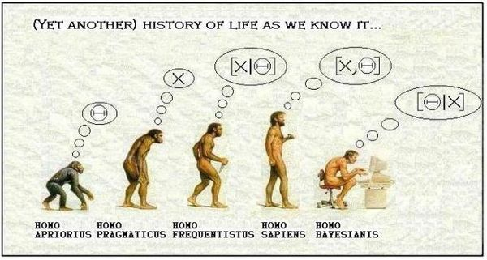

```{r setup, include=FALSE, cache=FALSE}
source("setup_knitr.R")
```
[](https://github.com/leg-ufpr/bayes2/actions/workflows/render-and-publish.yml)

<center>
{width=5in}
</center>

# Informações sobre a oferta da disciplina

- **Curso:** Estatística e Ciência de Dados
- **Período:** primeiro semestre de 2026 
- **Horários e Locais:**
  - Seg, 20:45 - 22:30h, **Lab B**
  - Qua, 19:00 - 20:30h, **Lab B**
- **Professores Responsáveis:** 
  - Paulo Justiniano Ribeiro Jr.
    - **Horários de atendimento do professor (sala do LEG):**
    - segundas e terças, 17:00 - 19:00 (preferenciais). 
    - Outros horários podem ser agendados previamente por email.
  - Fernando Pol Mayer
    - **Horários de atendimento do professor (sala do LEG):**
    - . definir 
    - Outros horários podem ser agendados previamente por email.
- **Frequência**: de acordo com as normas da Universidade, mínimo de 75%
- A Nota na disciplina será dada pela média de avaliações e trabalhos/apresentações.
  - Critérios para aprovação:
    - Frequência de pelo menos 75% e nota igual ou acima de 70 → Aprovação sem Exame Final.
    - Frequência de pelo menos 75% e Nota entre 40 e 70 → Exame Final.
    - Média entre Nota e Exame Final igual ou acima de 50 → Aprovação.
    - Nota inferior a 40 ou presença inferior a 75% → Reprovação.
    - Média entre Nota e Exame Final inferior a 50 → Reprovação.
<!--  - [Notas das avaliações](./misc/notas2025.html) -->

# Calendário 2026 (cursos de 15-18 semanas)

- [Resolução 22/25 - CEPE - Calendário para o ano de 2026](https://soc.ufpr.br/wp-content/uploads/2025/11/Res.-no-22-25-CEPE-.pdf)
- **Feriados/recessos:**
  - 03/04 (sex) Feriado: Paixão de Cristo
  - 21/04 (ter) Feriado: Tiradentes
  - 01/05 (sex) Feriado: Dia do trabalho
  - 04/06 (qui) Feriado: Corpus Christi

- **Avaliação** (datas a confirmar):
  - A nota na disciplina a média ponderada de avaliações (90%) e trabalho (10%).
      - **25/03/2026**: Primeira Avaliação
      - **06/05/2026**: Segunda Avaliação
      - **17/06/2026**: Terceira Avaliação
      - **a definir/05/2026**: Entrega e apresentação dos trabalhos. (pode ser antecipada a pedido)
      - **28/06/2026**: Prova Final
  - Notas das avaliações 
<!--    - [Disponíveis neste link](./notas/CE312-2026.html) -->
  - Critérios para aprovação:
      - Frequência de pelo menos 75% e nota igual ou acima de 70 →  Aprovação sem Exame Final.
      - Frequência de pelo menos 75% e Nota entre 40 e 70 →  Exame Final.
      - Média entre Nota e Exame Final igual ou acima de 50 →  Aprovação.
      - Nota inferior a 40 ou presença inferior a 75% →  Reprovação.
      - Média entre Nota e Exame Final inferior a 50 →  Reprovação.
<!--  - [Notas](./CE089notas.html) -->
<!--  - [Questões das provas realizadas](./CE089questoes.html) -->
<!-- - **Moodle:** [Página no Moodle](https://ufprvirtual.ufpr.br/course/view.php?id=23573) da disciplina -->
 

<!--

# Questionário

Participantes dever preencher o [questionário inicial](https://forms.gle/WMEn2uVXZSMGS9Fj7) do curso antes da primeira aula.

-->

# Programa/objetivos da disciplina

1. Introdução à inferência Bayesiana.
2. Aplicações.

# Conhecimento prévio

- É esperado que participantes tenham cursado/tenham conhecimento sobre:
  - Probabilidades (1)
  - Inferência Estatística
  - Estatística Computacional
  - Regressão
  - Inferência Bayesiana (nocções introdutórias como em CE-315)	


<!-- # Ementa -->

<!-- Teorema de Bayes. Distribuição e priori e a posteriori. Regra de Jeffreys. Estatísticas suficientes: restrições nos parâmetros. Comparação entre variâncias. Distribuição normal. -->

<!-- links -->

<!--
[Paulo Justiniano Ribeiro Jr.]: http://leg.ufpr.br/~paulojus
[Fernando de Pol Mayer]: http://leg.ufpr.br/~fernandomayer [LEG]: http://www.leg.ufpr.br 
[Resumo principais datas]: http://www.prograd.ufpr.br/portal/wp-content/uploads/2024/07/Calenda%CC%81rio-2024_2.pdf
-->

